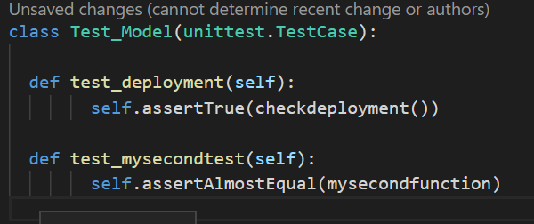
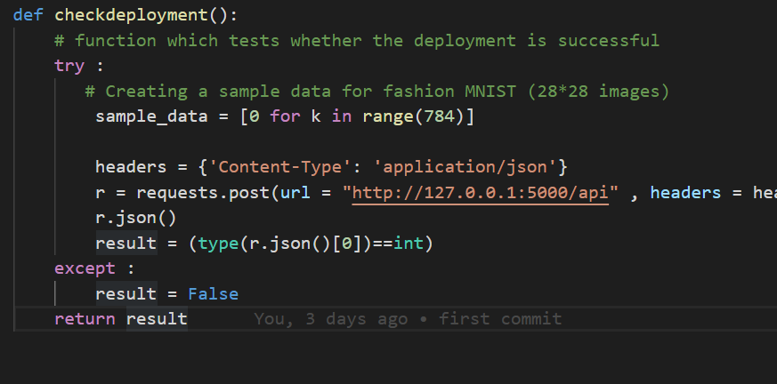

# Unit tests   

## Why are unit tests?  

Unit tests have been an integral part of the coding life forever. Although the code we are writing is, *in general*, clear in our head when we write it, we always need to test it by running it and checking its results. So the natural thing is to executre the code, and check that it is doing what we want. 

#### **1. Scaling in complexity**

This manual labour works fine when the complexity of a program fits in a human mind. However, most industrial products see many iterations, with developpers coming and going. This leads to a state of the code where a single mind would need an enormous effort to conceive all of the code at once and know what to check to correct it.

To help with this *scaling in complexity*, most industrial organizations implement unit tests which serves as a "proxy" to understand the code and track down bugs.

#### **2. Automated testing**

Checking that all of the codebase works after a change and that *b* was not broken by fixing *a*  is a tedious process which can be automatized. So as long as the automated testing is something that you need to test on a regular basis, those tests are useful.

## So, are unit tests really so good?

Unit tests are usually unavoidable to be able to scale a product or a project. However, in some cases of old legacy code, developers end up relying entirely on unit tests to understand the code, and it leads to a dissonnace which makes coding un-fun and any true innovation or deep modification nearly impossible. 

## Then, what is a good unit test ?
A good unit test has some of the following characteristics :
1. **It is elementary** : a unit test, as the name implies, is only testing for one thing. 
2. **It is a boolean** : it gives true if your code is good for that test, false otherwise.  
3. **It is easily understandable** : a unit tests named test314159 randomly switching from true to false over the iterations discourages the future dev.
4. **It checks something useful** : a unit test going to false should be a big deal which requires immediate attention.
5. **It is robust** : a codebase changes over the time, but unit tests should change as little as possible.

## Still, when should I unit test?

Unit test take time to write (about 10% of the coding time, depending widely). As such, writing coding tests during a hackathon or a short project is just a loss of time. Unit tests should be written over code which is there to last, and when the complexity of that code justifies a proxy relay. It is the case of the AI pipeline of Fix That Shirt, as different algorithms have to talk together and that bugs over a black boxe are very bad.

When a bug is coming from the user and that you fix it, you should implement a test to make sure this bug won't come in again, and then test it before releasing any future bugs.

## Ok but then, how to unit test ? (in Python)

In python, one of the main frameworks for unit testings is pytest. Pytest is well supported and answers most of the testing needs. 

It is implemented through a main funciton, unit_test.py, which will call sevral test functions, in test_functions.py.

The syntax of the main is to have a function per test which depends on self (and possibly env variables) and which will give out a bool, of whether the test is working or not. It starts with test_**** 

The helper functions can take different forms, and will hold most of the complexity of the testing, and will be samples of code which can serve you as a base to write some other bits of code.

To write your own tests, you need to :
1.  Identify what are the unit functionnalities of your code
2.  Write the helper functions which will fetch you the information you would fetch on your console
3.  Call them from the right function in unit_test.py

In this project, here are the unit test functions which are awaited :
- checkTrainingMethod
- checkModelSaving
- checkTrainingDataFormat 
- checkDeployment 
- checkPrecision

Don't hesitate to change those if you believe there are other functionnalities which are needed.

## But, I am a data scientist, not a software developer

The best practices of software development often time apply to data science. Data-based unit tests sometime need some twisting to work. Software development have inveted a smart solution to a problem data scientists are facing, and it is stupid not to use it.